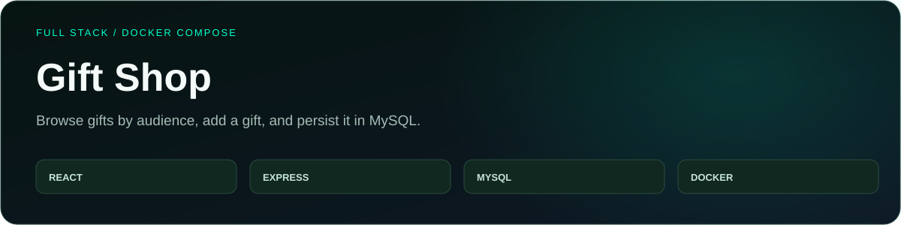

<p align="center">
  
</p>

<p align="center">
  <a href="#running-locally"></a>
  <a href="https://github.com/itaygoldenberg/gift-shop"></a>
  <a href="https://github.com/itaygoldenberg?tab=repositories"></a>
  <a href="https://www.linkedin.com/in/itay-goldenberg/"></a>
</p>

<p align="center">
  <a href="#overview">Overview</a>&nbsp;&middot;&nbsp;
  <a href="#features">Features</a>&nbsp;&middot;&nbsp;
  <a href="#workflow">Workflow</a>&nbsp;&middot;&nbsp;
  <a href="#technology">Technology</a>&nbsp;&middot;&nbsp;
  <a href="#running-locally">Running locally</a>
</p>

> [!NOTE]
> A full-stack course portfolio project by Itay Goldenberg. Browse gifts by audience, add a gift, and persist it in MySQL.

## Overview

Gift Shop is a React catalogue backed by an Express API and a MySQL database. Visitors select an audience to browse matching gifts, while the add-gift form sends a validated record to the backend.

The repository demonstrates a complete read-and-create path: component, HTTP service, controller, business service and parameterized SQL. Docker Compose connects the three runtime services.

<table><tr><td align="center" width="25%"><strong>REACT</strong><br /><sub>catalogue and forms</sub></td><td align="center" width="25%"><strong>EXPRESS</strong><br /><sub>three API routes</sub></td><td align="center" width="25%"><strong>MYSQL</strong><br /><sub>persistent gifts</sub></td><td align="center" width="25%"><strong>DOCKER</strong><br /><sub>three services</sub></td></tr></table>

| Project detail | Implementation |
|---|---|
| React + TypeScript | Catalogue, routing and typed forms |
| Express + Zod | HTTP routes and server-side gift validation |
| mysql2 + MySQL | Parameterized queries and persistence |
| Vite + Docker Compose | Client tooling and local multi-service startup |

## Contents

- [Overview](#overview)
- [Features](#features)
- [Workflow](#workflow)
- [Technology](#technology)
- [Project structure](#project-structure)
- [Running locally](#running-locally)
- [Running with Docker](#running-with-docker)
- [Checks](#checks)
- [Additional details](#additional-details)
- [Operational notes](#operational-notes)
- [Author](#author)

## Features

### Audience-based catalogue

The client requests the audience list, then fetches gifts for the selected audience ID.

### Validated gift creation

The add-gift route constructs a GiftModel and validates audience, name, description, price and discount with Zod before inserting the row.

### Parameterized database access

The service supplies SQL parameters separately from its queries and returns the newly assigned ID to the client.

### Containerized development

Compose builds the client and API and starts MySQL 8 with an initialization directory and a named data volume.

## Workflow

<p align="center">
  
</p>

1. **REACT CLIENT:** Select an audience or submit a gift.
2. **EXPRESS API:** Route the request to DataService.
3. **MYSQL:** Read matching rows or insert a gift.
4. **CATALOGUE:** Render typed records and creation feedback.

## Technology

<p align="center">
  
</p>

| Technology | Role |
|---|---|
| React + TypeScript | Catalogue, routing and typed forms |
| Express + Zod | HTTP routes and server-side gift validation |
| mysql2 + MySQL | Parameterized queries and persistence |
| Vite + Docker Compose | Client tooling and local multi-service startup |

## Project structure

```text
Backend/src/       controllers, services, models and database access
Frontend/src/      React pages, forms and HTTP services
Database/          SQL initialization files
compose.yaml       MySQL, backend and frontend services
docs/              README artwork
```

## Running locally

Clone the repository, then follow the application-specific steps below. Commands assume the repository root unless a directory change is shown.

```bash
git clone https://github.com/itaygoldenberg/gift-shop.git
cd gift-shop
```

Use Node.js 24 and a local MySQL instance. Import the SQL file under `Database/` into a `giftshop` database. Create `Backend/.env` (no example file is currently included):

```env
ENVIRONMENT=development
MYSQL_HOST=127.0.0.1
MYSQL_USER=your_mysql_user
MYSQL_PASSWORD=your_mysql_password
MYSQL_DATABASE=giftshop
```

Start the API in one terminal:

```bash
cd Backend
npm install
npm start
```

Start the client in a second terminal, starting from the repository root:

```bash
cd Frontend
```

```bash
npm install
npm run dev
```

Open the local address printed by Vite. The API listens on port 4000. The client defaults to `http://localhost:4000`; `Frontend/.env` can override it with `VITE_SERVER_URL`.

## Running with Docker

Create `Backend/.env` as above and create `Frontend/.env` containing `VITE_SERVER_URL=http://localhost:4000` before starting: both files are bind-mounted by Compose. From the repository root:

```bash
docker compose up --build -d
docker compose ps
docker compose logs backend-service
```

Open **http://localhost** (host port 80); the API is on **http://localhost:4000**. Compose overrides the database connection values for its internal MySQL service. SQL initialization runs when the database volume is first created. Stop with `docker compose down`; the named volume retains data.

## Checks

In `Frontend`, run `npm run build`. With the API and database running, select an audience, add a valid gift, then return to that audience and verify the new record. Submit invalid data to verify validation. The backend has no build or test script.

These are available build commands and suggested manual checks, not a claim that a full integration test suite is included.

## Additional details

| Method | Route | Result |
|---|---|---|
| GET | `/api/audience` | Audience records |
| GET | `/api/gifts-by-audience/:audienceId` | Matching gifts |
| POST | `/api/gifts` | Created gift with its ID |

## Operational notes

The Compose file contains development database credentials and runs Vite rather than a production static server. It does not define a database readiness healthcheck. Authentication helpers exist in the source, but the three catalogue routes are not an implemented login or checkout system.

## Author

<p align="center">
  <strong>Itay Goldenberg</strong><br />
  <sub>Full Stack Developer Student &middot; John Bryce</sub>
</p>

<p align="center">
  <a href="https://github.com/itaygoldenberg"></a>
  <a href="https://www.linkedin.com/in/itay-goldenberg/"></a>
</p>
